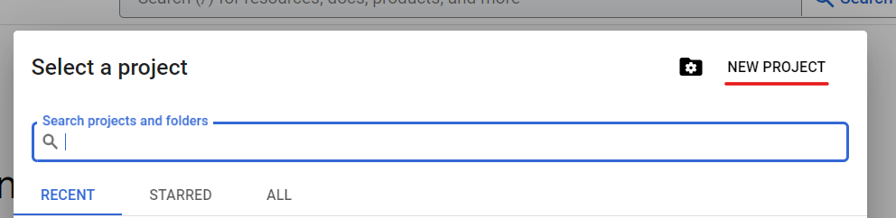
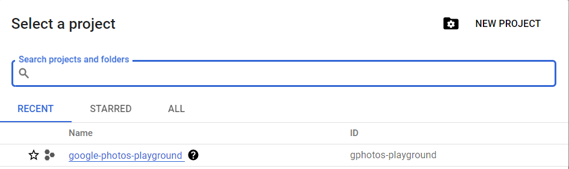
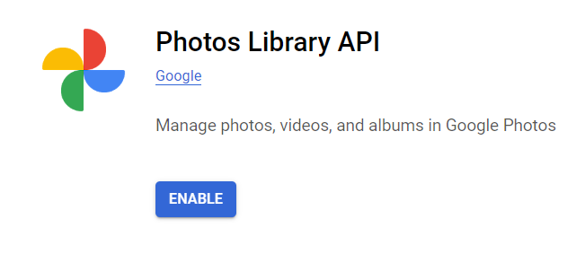
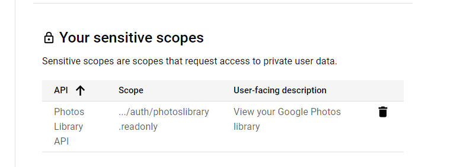
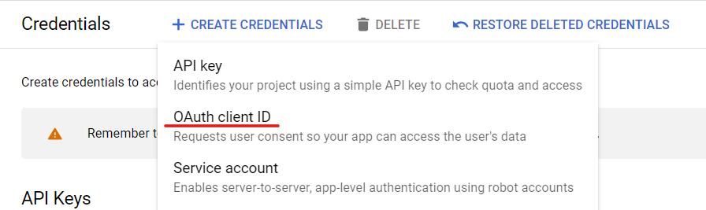
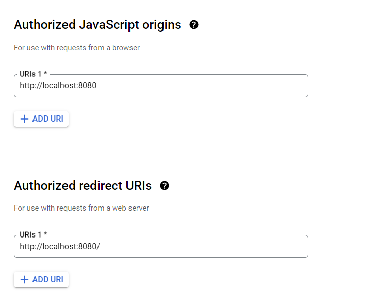

# Google Photos Contact Sync
## Disclaimer
Hello there! If you're here it is probably because you want to sync your [Google Contacts](https://contacts.google.com/)' pictures with their associated [Google Photos](https://photos.google.com/) featured photos in the [people's tab](https://photos.google.com/people). If so, you've come to the right place.

**It is not currently possible as of August 2023.**

Indeed, as detailed in their [documentation](https://developers.google.com/photos/library/guides/apply-filters#content-categories), you can only filter the photos by content categories, which do contain *PEOPLE*, but it will not allow you to get the actual name used in the people's tab, if any is associated with it.

Such a functionality would need to be implemented by Google or through web scraping, which is not the purpose of this repository.

## If you still want to play with the Google Photos' API in Python
This repository contains a simple Python notebook that uses the [Google Photos' API](https://developers.google.com/photos/library/guides/get-started) to retrieve a list of photos in one's library and download one locally.

This is meant as a bunch of very simple examples to get started with the API.

## How to use
### Prerequisites in GCP
* You will need to have a Google account and to create a project on the [Google Cloud Platform](https://console.cloud.google.com/).
* Go to the project by clicking on its name
* Go to the [Google Photos' API manager](https://console.cloud.google.com/apis/library/photoslibrary.googleapis.com) for your project and enable it. It will take a few seconds.
* Let's configure the Consent Screen, go to the [OAuth Consent Screen](https://console.cloud.google.com/apis/credentials/consent), choose *External* and create. Fill in the different forms, we will not publish the application so this doesn't matter too much. (It would seem that if you type have "Google" in the application name, it won't let you proceed.)
* In the scopes, add *https://www.googleapis.com/auth/photoslibrary.readonly*
* Add yourself as a test user
* You're not ready to create the OAuth Client ID.
* You will need to create an OAuth 2.0 Client ID for your project. In the [API Credentials](https://console.cloud.google.com/apis/credentials), choose *Create Credentials* and *OAuth client ID*. 
* Let's choose a web application, and the origins as follow:
* Finally, download the associated JSON file (download it as *oauth_client_secret.json* at the base of the project directory).

### Running the notebook
* Run `pip install -r requirements.txt` to install the required dependencies.
* Use either VSCode (or your favorite IDE) or Jupyter Notebook to run the `main.ipynb` notebook.
* Different examples are available in the notebook, you can run them one by one. You will need to update the `credentials.json` file path to match your own.
